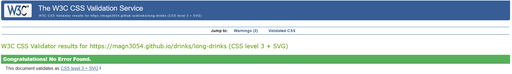
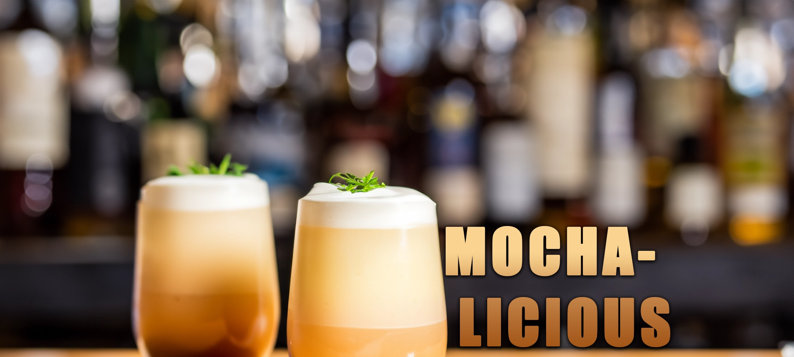

# Drinkz

## Hjemmeside

https://magn3054.github.io/drinks/

## HTML & CSS validation

### HTML

Alle html filer er godkendt af html validator dog med to warnings om at jeg mangler h2-h6 text.

<div>


</div>


### CSS

Alle css filer er godkendt af css validator.





## Navngivning af mappe og filnavne samt struktur

Css, javascript og billeder er lagt i henholdsvis hver deres mappe mens index og de andre html filer ligger i rod-mappen.

## Semantiske tags og CSS egenskaber

Primært har jeg brugt article og section tags i min html kode, udover det har jeg gjort brug af div tags sammensat med klasser for at skabe containere der hjalp med at opbygge min struktur af kasser til sidernes layout.

Hver side og udnerside er udformet med en header, en main-del og en footer som er stylet i page-layout.css
herefter har hver side fået deres egen css fil der styler main-delen på siden (undtagen Gin og Tequila som deler tequilas' css fil).

Css filerne er sorteret efter hvornår selectoren bliver brugt i html'en. I filer såsom alkoholtyper.css har jeg valgt at vise hvordan man vælger specifikke elementer.

## Performance

## Highlightede kode

```html
<section class="slideshow">
  <div class="slides fade">
    <a href="https://magn3054.github.io/drinks/stand-by.html"
      ></a>
  </div>
  <div class="slides fade">
    <a href="https://magn3054.github.io/drinks/stand-by.html"
      ></a>
  </div>
  <div class="slides fade">
    <a href="https://magn3054.github.io/drinks/stand-by.html"
      ></a>
  </div>
  <div style="text-align:center">
    <span class="dot"></span>
    <span class="dot"></span>
    <span class="dot"></span>
  </div>
</section>
```
