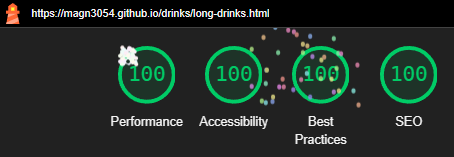

# Drinkz

## Hjemmeside

https://magn3054.github.io/drinks/

## HTML & CSS validation

### HTML

Alle html filer er godkendt af html validator dog med to warnings om at jeg mangler h2-h6 text.
Billederne kan klikkes på for at se dem i bedre opløsning.

<div>


</div>
<div>


</div>
<div>


</div>

### CSS

Alle css filer er godkendt af css validator.

<div>


</div>
<div>


</div>
<div>


</div>

## Navngivning af mappe og filnavne samt struktur

Css, javascript og billeder er lagt i henholdsvis hver deres mappe mens index og de andre html filer ligger i rod-mappen.

## Semantiske tags og CSS egenskaber

Primært har jeg brugt article og section tags i min html kode, udover det har jeg gjort brug af div tags sammensat med klasser for at skabe containere der hjalp med at opbygge min struktur af kasser til sidernes layout.

Hver side og udnerside er udformet med en header, en main-del og en footer som er stylet i page-layout.css
herefter har hver side fået deres egen css fil der styler main-delen på siden (undtagen Gin og Tequila som deler tequilas' css fil).

Css filerne er sorteret efter hvornår selectoren bliver brugt i html'en. I filer såsom alkoholtyper.css har jeg valgt at vise hvordan man vælger specifikke elementer.

## Performance





## Highlightede kode

Koden her er fra index-filen. Den strukturer slideshowet i toppen af siden. Cirklerne der viser brugeren hvilket billede man er på, er blevet stylet inline eftersom det var nemmere og hurtigere da de bare skulle centreres.

```html
<section class="slideshow">
  <div class="slides fade">
    <a href="https://magn3054.github.io/drinks/stand-by.html"
      ></a>
  </div>
  <div class="slides fade">
    <a href="https://magn3054.github.io/drinks/stand-by.html"
      ></a>
  </div>
  <div class="slides fade">
    <a href="https://magn3054.github.io/drinks/stand-by.html"
      ></a>
  </div>
  <div style="text-align:center">
    <span class="dot"></span>
    <span class="dot"></span>
    <span class="dot"></span>
  </div>
</section>
```

Her ses de selectorer som indeholder de mere specielle deklarationer
Primært ligger fokus på `@keyframes fade` da denne del gør at billederne fader ud og ind.

```css
.slides {
  display: none;
}

.dot {
  height: 0.5rem;
  width: 1.5rem;
  margin: 0.6rem 0.12rem;
  background-color: #717171;
  display: inline-block;
  transition: background-color 0.6s ease;
}

.fade {
  animation-name: fade;
  animation-duration: 1.5s;
}

@keyframes fade {
  from {
    opacity: 0.4;
  }
  to {
    opacity: 1;
  }
}
```

Javascript er det der sørger for at nye billeder kommer til og erstatter de gamle.
Først sætter vi slideIndex til 0, dernæst kører funktionen `showSlides()`

`showSlides()` angiver i som vil blive brugt i loopet, dernæst angiver slides og dots til henholdsvis slides og dot klasserne.

Et loop løber alle elementerne i slides arrayet igennem.
For hvert slide sættes display CSS-attributten til "none", hvilket skjuler dem fra visningen.

slideIndex variablen øges med én.
Hvis slideIndex overstiger antallet af slides, nulstilles den til 1, hvilket giver loop-effekten.

Et loop gennemgår så alle elementerne i dots arrayet.
For hvert punkt fjernes klassen "active" fra deres className.

Det aktuelle slide og dets tilsvarende prik markeres ved at ændre deres stil og klasseattributter.
`slideIndex - 1` bruges til at få det korrekte slide og punkt baseret på slideIndex, og derefter vises slideet ved at ændre display til "flex" og prikken markeres ved at tilføje "active" til dens klasseattribut.

setTimeout funktionen bruges til at kalde showSlides-funktionen igen efter 5000 millisekunder (5 sekunder). Dette sikrer, at diasshowet skifter billeder med den givne tidsforsinkelse.

```javascript
let slideIndex = 0;
showSlides();

function showSlides() {
  let i;
  let slides = document.getElementsByClassName("slides");
  let dots = document.getElementsByClassName("dot");
  for (i = 0; i < slides.length; i++) {
    slides[i].style.display = "none";
  }
  slideIndex++;
  if (slideIndex > slides.length) {
    slideIndex = 1;
  }
  for (i = 0; i < dots.length; i++) {
    dots[i].className = dots[i].className.replace(" active", "");
  }
  slides[slideIndex - 1].style.display = "flex";
  dots[slideIndex - 1].className += " active";
  setTimeout(showSlides, 5000); // Change image every 5 seconds
}
```
